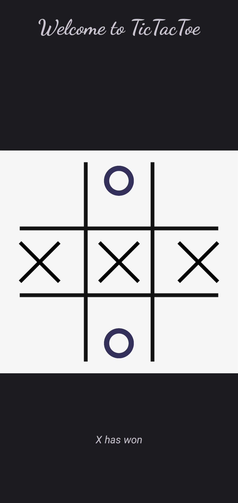

# Multiplayer Tic-Tac-Toe Android App

Play the classic game of Tic-Tac-Toe with your friends on Android devices!

## Introduction

Welcome to the Multiplayer 3 by 3 Tic-Tac-Toe Android app! This app brings the age-old game of Tic-Tac-Toe to your fingertips, 
allowing you to challenge your friends to exciting matches right on your Android device.

## Features

- **Multiplayer Gameplay:** Challenge your friends to a game of Tic-Tac-Toe and see who emerges victorious.
- **Interactive Interface:** The user-friendly interface lets you tap on cells to place your moves.
- **Win Detection:** The app automatically detects when a player has won the game and displays the result.
- **Reset Functionality:** Start a new game with a single tap on the screen.

## How to Play

1. Clone the repository to your local machine.
2. Open the project in Android Studio.
3. Build and run the app on an emulator or a physical device.
4. Play the game with a friend by taking turns to tap on empty cells to place your markers (X or O).
5. The app will determine the winner or a draw and display the outcome.
6. To begin a new game, simply tap on the screen at the end of the game.

## Technologies Used

This app is built using Java and XML within the Android Studio IDE.

## Contributing

We welcome contributions from the community! To contribute to the project:

1. Fork the repository.
2. Create a new branch for your feature or bug fix.
3. Commit your changes and push the branch.
4. Create a pull request detailing your changes.

Please ensure that your contributions align with our coding standards and guidelines.

## Enjoy the Game

Download the app, challenge your friends, and enjoy hours of fun playing Multiplayer Tic-Tac-Toe!
